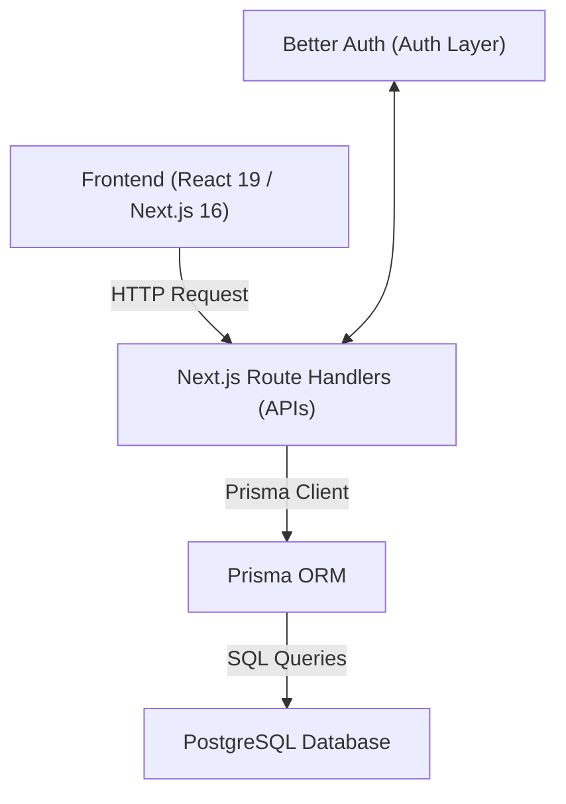
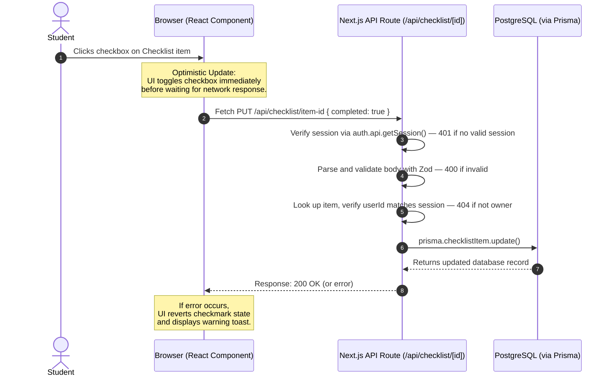

# Project Architecture & Tech Stack: InternTrack OJT Tracker

> **Revision notes:** Updated 2026-07-24 — Production deployment is now live at `https://intern-track-ojt-tracker.vercel.app`. A post-deployment debugging session resolved a three-layer redirect loop bug (proxy cookie name mismatch, missing `baseURL`, `router.refresh()` race — see Section 11). Status table updated; Section 8 annotated as live.

Welcome! If you are preparing for a career in software engineering, this project is built using the same **architectural patterns, frameworks, and tools** that modern tech companies use.

This document breaks down how the OJT Tracker is structured, how data flows through it, and why these choices align with professional industry standards — and just as importantly, it's explicit about what's actually running today versus what's designed but not yet built. A doc that blurs that line reads as inflated the moment someone opens the repo; this one doesn't.

---

## Table of Contents
0. [Current Implementation Status](#0-current-implementation-status)
1. [The Core Tech Stack](#1-the-core-tech-stack)
2. [Directory Layout & Key Files](#2-directory-layout--key-files)
3. [Data Flow: How a Request Travels](#3-data-flow-how-a-request-travels)
4. [Key Design Patterns & Technical Decisions](#4-key-design-patterns--technical-decisions)
5. [Environment Variables & Secrets Management](#5-environment-variables--secrets-management)
6. [Security Practices Applied](#6-security-practices-applied)
7. [Testing Strategy (Planned)](#7-testing-strategy-planned)
8. [Deployment](#8-deployment)
9. [Error Handling & Loading States](#9-error-handling--loading-states)
10. [Roadmap: What Phase 7 Actually Unlocks](#10-roadmap-what-phase-7-actually-unlocks)

---

## 0. Current Implementation Status

Before anything else — here's what's actually running today versus what's designed but not yet built. Keep this table current as you go. It's worth more to an interviewer than a document that only describes a finished target state, because it shows you know the difference.

| Feature | Status |
| :--- | :--- |
| Dashboard UI, progress cards, empty-state guidance | ✅ Built |
| Checklist read / toggle UI | ✅ Built |
| Checklist create / delete UI | ✅ Built — Stage 2 complete |
| Internship history — list, add, edit per-ID | ✅ Built — Stage 2 complete |
| Internship archive (soft-hide, reversible) | ✅ Built — Stage 3 complete |
| Internship delete with count-based modal guard | ✅ Built — Stage 3 complete |
| Optimistic UI updates | ✅ Built |
| Input validation with Zod | ✅ Built |
| Dashboard loading skeleton (`loading.js`) | ✅ Built |
| Dashboard error boundary (`error.js`) | ✅ Built |
| Database schema & Prisma migrations | ✅ Built (5 migrations tracked) |
| Development-safe database connections (singleton) | ✅ Built |
| Authentication (Better Auth) | ✅ Built — Phase 7 complete |
| Session-based IDOR protection | ✅ Built & verified (14/14 checks pass) |
| Password hashing | ✅ Built — Better Auth handles hashing via scrypt |
| Route protection (proxy.js) | ✅ Built — checks both `__Secure-` (HTTPS/production) and plain (HTTP/dev) cookie names |
| Production-safe connection pooling | 🔜 Planned — see Section 4B |
| Deployment | ✅ Live — `https://intern-track-ojt-tracker.vercel.app` (2026-07-24) |

All security and auth behavior described below reflects the **current live implementation**, not just a target design.

---

## 1. The Core Tech Stack



| Technology | Role | Why It's Chosen (Industry Perspective) |
| :--- | :--- | :--- |
| **Next.js (App Router)** | Framework | Next.js is the industry standard for React development. The **App Router** allows us to write both frontend pages and backend APIs in a single repository (monorepo structure), simplifying deployment and code sharing. |
| **React 19** | UI Library | React is the most widely-used frontend library in the world. Learning React and its state-management paradigms is one of the most bankable skills in modern web development. |
| **Prisma ORM** | Object-Relational Mapper | Prisma abstracts away complex SQL queries. Instead of writing raw SQL strings, you write code in type-safe TypeScript/JavaScript. It makes database changes easily trackable via migrations. |
| **PostgreSQL** | Database | Postgres is a robust, production-grade relational database. It is highly reliable, scales exceptionally well, and is preferred by companies of all sizes over simpler database solutions. |
| **Better Auth** | Authentication | Setting up secure login systems from scratch is error-prone, so a dedicated library is the right call either way. See the note below for why this project uses Better Auth specifically, rather than the more commonly-tutorialized NextAuth.js. |

> **Why Better Auth instead of NextAuth.js / Auth.js?** NextAuth.js renamed to Auth.js as it expanded beyond Next.js, and as of this writing it's in maintenance mode — security patches only, no new feature development, and its own maintainers now point new projects toward Better Auth instead. Better Auth is self-hosted the same way Auth.js is (sessions live in our own Postgres database, not a third party's), so nothing about the architecture diagram above changes — only the library managing the auth layer does. If this project already had a working Auth.js setup, switching wouldn't be worth the churn; starting fresh, Better Auth is the better default.

---

## 2. Directory Layout & Key Files

Here is how the project files are organized and what each directory is responsible for:

```text
ojt-tracker/
├── prisma/                      # Database schema & migration files
│   ├── migrations/              # SQL history — every schema change tracked here
│   └── schema.prisma            # Single source of truth for the database design
│
├── src/
│   ├── app/                     # Next.js App Router (pages and APIs)
│   │   ├── api/
│   │   │   ├── auth/[...all]/   # Better Auth catch-all handler
│   │   │   ├── checklist/       # Checklist CRUD endpoints (+ /[id])
│   │   │   ├── internships/     # Internship CRUD endpoints (+ /[id])
│   │   │   └── logs/            # Log entry CRUD endpoints (+ /[id])
│   │   ├── dashboard/           # Student dashboard UI
│   │   │   ├── internships/     # Internship management
│   │   │   │   ├── page.js      # List all internships (active, history, archived)
│   │   │   │   ├── new/         # Create new internship form
│   │   │   │   └── [id]/edit/   # Edit a specific internship by ID
│   │   │   ├── logs/new/        # Add daily log entry form
│   │   │   ├── profile/         # Redirects to /dashboard/internships
│   │   │   ├── error.js         # Error boundary for dashboard route
│   │   │   └── loading.js       # Loading skeleton for dashboard route
│   │   ├── login/               # Sign-in page
│   │   ├── register/            # Sign-up page
│   │   ├── globals.css          # Global CSS (design system tokens)
│   │   ├── layout.js            # Root layout wrapping the HTML shell
│   │   └── page.js              # Root route: redirects to /dashboard if authenticated, /login if not
│   │
│   ├── components/
│   │   ├── dashboard/           # Dashboard components:
│   │   │   │                    #   ProgressCard, ChecklistCard, DailyLogCard,
│   │   │   │                    #   ActivityTimeline, QuickActions, DashboardHeader,
│   │   │   │                    #   InternshipSwitcher (Stage 2 — multi-active dropdown),
│   │   │   │                    #   InternshipList (Stage 3 — archive/delete UI),
│   │   │   │                    #   SignOutButton
│   │   └── ui/                  # Generic UI components (ThemeToggle)
│   │
│   ├── generated/               # Prisma client — gitignored, rebuilt automatically on install
│   │
│   └── lib/
│       ├── prisma.js            # Database connection singleton (see Section 4B)
│       ├── auth.js              # Better Auth server-side configuration
│       ├── auth-client.js       # Better Auth client-side hooks for "use client" components
│       └── dashboard-data.js    # Server-side data-fetching helpers
```

---

## 3. Data Flow: How a Request Travels

Let's trace how the application handles an action, like a student checking off an internship requirement on their checklist:



### Architectural Details:
1. **Optimistic Updates (Browser)**: In [ChecklistCard.js](file:///c:/Users/Welcome/Documents/GitHub/InternTrack-OJT-Tracker/ojt-tracker/src/components/dashboard/ChecklistCard.js#L25-L66), when a user checks an item, the checkbox toggles *instantly*. If the API fails later, it rolls back. This mimics premium apps (like Facebook likes or Twitter retweets) where the interface feels snappy.
2. **Input Validation (Backend)**: Before doing database operations, APIs use a library called **Zod** (e.g., in [logs/route.js](file:///c:/Users/Welcome/Documents/GitHub/InternTrack-OJT-Tracker/ojt-tracker/src/app/api/logs/route.js#L10-L15)) to validate that dates are real dates, hours are positive numbers, etc. This blocks corrupted inputs — and this runs on every request, after the session check.
3. **Database Client (ORM)**: Prisma generates a type-safe client in the `src/generated` directory. This acts as a bridge so we interact with database tables as standard JavaScript objects.

---

## 4. Key Design Patterns & Technical Decisions

### A. Server Components vs. Client Components (Next.js Hybrid Architecture)
Next.js separates components based on where they run:
- **Server Components** (default, like [dashboard/page.js](file:///c:/Users/Welcome/Documents/GitHub/InternTrack-OJT-Tracker/ojt-tracker/src/app/dashboard/page.js)): They run on the server. They can query databases directly, have zero impact on browser bundle size, and render pages faster.
- **Client Components** (marked with `"use client"`, like [ChecklistCard.js](file:///c:/Users/Welcome/Documents/GitHub/InternTrack-OJT-Tracker/ojt-tracker/src/components/dashboard/ChecklistCard.js)): They run in the browser. They can listen to user interactions (clicks, keyboard events) and keep track of local state (toggles, input fields).

**Why this is industry-standard:** Mixing these two yields fast initial load times (good for SEO and slow mobile networks) while preserving interactivity.

### B. Database Connection Management

This is actually two separate problems with two separate fixes — the original version of this doc only covered the first one.

#### B.1 — The Development Problem: Hot Module Replacement (Solved)

During development, Next.js performs **Hot Module Replacement (HMR)** to reload files as you edit code. If we just wrote `const prisma = new PrismaClient()` directly, every file save would instantiate a new database client. Eventually, you would exhaust PostgreSQL's max connection limit, crashing the server.

In [src/lib/prisma.js](file:///c:/Users/Welcome/Documents/GitHub/InternTrack-OJT-Tracker/ojt-tracker/src/lib/prisma.js), we cache the Prisma instance in a global object (`globalThis`):
```javascript
const globalForPrisma = globalThis;
export const prisma = globalForPrisma.prisma ?? new PrismaClient(...);
if (process.env.NODE_ENV !== "production") globalForPrisma.prisma = prisma;
```
This is the standard fix for the HMR problem specifically, and it's already implemented in this project.

#### B.2 — The Production Problem: Serverless Connection Exhaustion (Planned)

The singleton above solves duplicate clients from hot-reloading in development — it does **not**, on its own, solve a different problem that only shows up in production. When this app deploys to a serverless platform like Vercel, each API request can spin up its own short-lived function instance, and each instance can open its own database connection. Under real traffic, dozens or hundreds of these can run concurrently, and Postgres has a hard ceiling on total connections (100 is a common default). A handful of connections locally is fine; a traffic spike spread across many serverless invocations is how "too many connections" errors happen in production, even when the singleton pattern is correctly in place — these are genuinely separate problems and need separate fixes.

The practical fix for a project this size: use a managed Postgres provider with built-in connection pooling — Neon, Supabase, and Vercel's own Postgres offering all support this. In practice this usually means two connection strings instead of one:
- `DATABASE_URL` — a **pooled** connection string, used by the running app
- `DIRECT_URL` — a **direct** connection string, used only when running migrations

This is a configuration change, not a code change — the singleton pattern in B.1 stays exactly as-is either way.

### C. Database Migrations (Schema Version Control)
Instead of manually opening database management apps to create tables, we use Prisma migrations. When the schema changes, Prisma records the changes in SQL files under `prisma/migrations`.

One command distinction worth internalizing before Section 8 (Deployment): `prisma migrate dev` is for local development — it's interactive, and in some conflict scenarios it can reset data. `prisma migrate deploy` is the production-safe counterpart — non-interactive, and it only applies pending migrations without prompting or resetting anything. The deployment pipeline should only ever run `migrate deploy`.

**Why this is industry-standard:** This works like Git, but for your database structure. Multiple developers working on the same project can synchronize their databases instantly by running `npx prisma migrate dev` locally, while production stays on the safer `migrate deploy` path.

---

## 5. Environment Variables & Secrets Management

None of the secrets this app needs — database credentials, the auth secret key, OAuth client IDs — should ever be committed to the repository. The convention:

- **`.env`** — holds real values locally. Gitignored, never pushed.
- **`.env.example`** — should be committed to the repo, listing every variable name with placeholder values so anyone cloning the repo knows what to configure. This file still needs to be created (it's in the deployment checklist).

For this project, the required variables are:

| Variable | Purpose |
| :--- | :--- |
| `DATABASE_URL` | Connection string the running app uses; must be a **pooled** URL when deploying to serverless (Section 4B) |
| `BETTER_AUTH_SECRET` | Signs and encrypts session tokens — generate with `openssl rand -base64 32` |
| `BETTER_AUTH_URL` | Full public URL of the deployed app (e.g. `https://your-app.vercel.app`) — used by Better Auth to construct callbacks and redirects |
| `DIRECT_URL` | Direct (non-pooled) connection string — only needed when running `prisma migrate deploy` against a managed pooler in CI/CD |
| OAuth client ID / secret | Optional — only needed if adding Google/GitHub login in the future |

In production, these live in the hosting platform's dashboard (for Vercel: Project Settings → Environment Variables) — not in a file at all.

---

## 6. Security Practices Applied

> **Status check:** Everything below describes the **live, implemented** security model as of Phase 7 (2026-07-16). The hardcoded `temp-user-1` placeholder has been fully replaced with real Better Auth sessions. IDOR protection was verified by a 14-check test matrix — all checks passed.

Actual industries evaluate backend code on how it handles security. This project is designed to enforce:

1. **No Trusted Client Inputs (IDOR Protection)**:
   A common security vulnerability is *Insecure Direct Object Reference*. For example, a user logs in and tries to fetch their logs, but they manually change the query from `/api/logs?userId=1` to `/api/logs?userId=2` to view someone else's logs.
   *Resolution:* We do not rely on user IDs sent from the client-side browser. Instead, our backend APIs read the user ID directly from the secure, encrypted **server session** using Better Auth.
2. **Password Security**:
   Better Auth's default hashing algorithm is scrypt. Passwords are hashed before storage — if the database is ever leaked, passwords remain unreadable.

---

## 7. Testing Strategy (Planned)

This project doesn't need a full test pyramid to make a strong impression — a small number of well-chosen tests, and the ability to explain *why* those specific ones were chosen, signals more engineering judgment than either no tests at all or an over-tested todo app. A realistic, proportional plan:

- **Zod schema tests** — cheap to write, and they directly protect the one thing every API route depends on: valid input. Good first target.
- **One or two integration tests for the checklist update flow** — this is the core interactive feature from Section 3, so it's the highest-value thing to protect against regressions.
- **Skip UI snapshot testing for now** — it adds maintenance overhead disproportionate to what it catches at this project's size.

Vitest or Jest are both reasonable choices for a Next.js project; either is fine to name in an interview as "what I'd reach for," even before every test is actually written.

---

## 8. Deployment

Given the stack, Vercel is the natural fit — it's built by the same team as Next.js and is the default target most Next.js tutorials and docs assume.

> **Status: Live as of 2026-07-24.** Production URL: `https://intern-track-ojt-tracker.vercel.app`. All five items below are in place.

The pieces that need to be in place before "it's deployed" is actually true:

1. **Connect the GitHub repo to Vercel** ✅ — automatic deploys on every push to the main branch.
2. **Set every variable from Section 5** in the Vercel dashboard ✅ — `DATABASE_URL`, `DIRECT_URL`, `BETTER_AUTH_SECRET`, `BETTER_AUTH_URL` (must include `https://` scheme — see Section 11.1).
3. **Make sure `prisma generate` runs on every build** ✅ — wired into the `postinstall` script in `package.json`.
4. **Run `prisma migrate deploy` against the production database** — Vercel's build step does not do this automatically; run it manually per schema change or add a CI step.
5. **Point production `DATABASE_URL` at the pooled connection string** from Section 4B ✅ — Neon pooled URL in use.

This is the section that turns "I built something" into "I shipped something" — a live URL is the actual deliverable for a portfolio, more than any of the code underneath it.

---

## 9. Error Handling & Loading States

Section 3 covers what happens when *one interactive element* (a checkbox) fails — the optimistic update rolls back. This section covers the other case: what happens when an entire page fails to load, e.g. the database is unreachable.

Next.js App Router gives this for free at the route level, through two special files:
- **`loading.js`** — shown automatically while a server component's data is being fetched, so the user sees something other than a blank screen.
- **`error.js`** — a client-side error boundary shown if a server component throws, so a broken page shows a recoverable message instead of a blank crash.

Both are cheap to add (see Section 2 for where they'd live under `dashboard/`), and they're the kind of small detail that reads as "this person has actually used Next.js in practice" rather than "this person followed a tutorial."

---

## 10. Phase 7 — Complete

Phase 7 is done. Here's what was actually implemented:

1. **Better Auth configured** with the Prisma adapter in `src/lib/auth.js` — `Session`, `Account`, and `Verification` models live in `prisma/schema.prisma`.
2. **Sign-up and login forms** built at `/register` and `/login`.
3. **Every `temp-user-1` reference replaced** with the real, session-derived user ID via `auth.api.getSession({ headers: await headers() })` in each API route handler.
4. **Password hashing** — handled automatically by Better Auth (scrypt).
5. **Route protection** — `src/proxy.js` (Next.js 16's replacement for `middleware.js`) performs a lightweight cookie-presence check; individual route handlers do the authoritative `getSession()` call.
6. **IDOR verification** — 14-check test matrix run on 2026-07-16:
   - Checks 1–9, 13–14 (cross-user access): all returned 404 ✅
   - Checks 10–12 (unauthenticated access): all returned 401 ✅
7. **Migration tracking fixed** — Better Auth schema changes (applied via `db push`) were captured as `prisma/migrations/20260716000000_add_better_auth/migration.sql` and registered with `migrate resolve --applied`. `prisma migrate status` now shows 4 migrations, schema up to date.

Deployment followed on 2026-07-24 — see Section 8 (live) and Section 11 (post-deployment bugs found and fixed).

---

## 11. Known Issues — Post-Deployment Bugs (All Fixed 2026-07-24)

All four of these were found and resolved during the first production login test after deployment.

### 11.1 — `BETTER_AUTH_URL` must include the full `https://` scheme

**Status:** Fixed (2026-07-24).

`BETTER_AUTH_URL` must be the full, scheme-qualified URL — e.g. `https://intern-track-ojt-tracker.vercel.app` — **not** the bare hostname. Without the `https://` prefix, Better Auth's URL parser cannot construct a valid base URL. Two downstream effects: (a) `auth.api.getSession()` may silently return `null` due to failed origin validation; (b) Better Auth does not know to use `__Secure-` prefixed cookies (see 11.3). Fix applied in both the local `.env` and the Vercel dashboard env var.

### 11.2 — Better Auth rejects Vercel auto-generated branch-preview URLs

**Status:** Known gap, low priority, not yet addressed.

When testing on Vercel's auto-generated branch-preview URLs (e.g. `https://intern-track-ojt-tracker-git-main-jennylyns-projects.vercel.app`), Better Auth logs:

```
[Better Auth]: Invalid origin: https://intern-track-ojt-tracker-git-main-jennylyns-projects.vercel.app
```

This is expected: Better Auth validates origins against `BETTER_AUTH_URL`, and Vercel's preview URLs don't match the production origin. Auth fails on preview deployments as a result. Not worth addressing until preview-environment testing becomes a regular workflow step. Future fix: configure `trustedOrigins` in `auth.js` (see [Better Auth docs](https://www.better-auth.com/docs/concepts/options#trusted-origins)).

### 11.3 — Proxy checked the wrong cookie name in production (the main blocker)

**Status:** Fixed (2026-07-24) in `src/proxy.js`.

This was the actual cause of the redirect loop. Better Auth automatically uses the `__Secure-` cookie prefix when the app runs over HTTPS:

| Environment | Cookie name set by Better Auth |
| :--- | :--- |
| Local dev (`http://`) | `better-auth.session_token` |
| Production (`https://`) | `__Secure-better-auth.session_token` |

The proxy was only checking the HTTP/dev name. In production the browser had the correct `__Secure-` prefixed cookie, but the proxy couldn't see it and redirected every request — before the dashboard server component was ever reached. The `?callbackUrl=%2Fdashboard` in the redirect URL was the diagnostic clue: that param is only added by the proxy, not by `dashboard/page.js`'s `redirect("/login")`.

Fix: check both names.
```js
const sessionToken =
  request.cookies.get("__Secure-better-auth.session_token") ??
  request.cookies.get("better-auth.session_token");
```

### 11.4 — `router.refresh()` in the login handler caused a race condition

**Status:** Fixed (2026-07-24) in `src/app/login/page.js`.

After a successful sign-in, the login handler called `router.push(callbackUrl)` followed immediately by `router.refresh()`. The `refresh()` call fires synchronously before the push navigation settles — it re-renders the **current page** (`/login`) server-side with stale request headers that don't yet include the freshly-set session cookie. This made `getSession()` return `null` on the re-render of the login page itself, and could interfere with the navigation timing in some network conditions. Fix: remove `router.refresh()` entirely — `router.push()` to `/dashboard` already triggers a full server render with fresh headers on the destination page.

### 11.5 — `auth.js` had no explicit `baseURL`

**Status:** Fixed (2026-07-24) in `src/lib/auth.js`.

Without `baseURL` set explicitly, Better Auth auto-detects the app URL from incoming request headers at serverless cold-start. This detection is unreliable in Vercel's environment and can silently cause `getSession()` to return `null`. Fix: pass `baseURL: process.env.BETTER_AUTH_URL` directly in the `betterAuth({})` config object.
